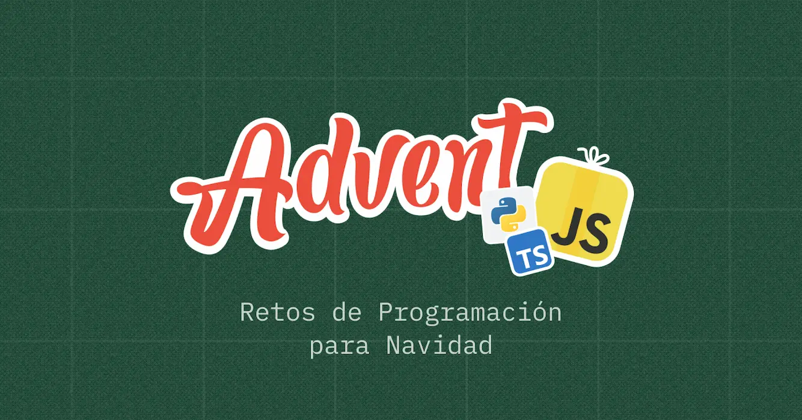

# [Advent JS 2024](https://adventjs.dev/) • (Solutions)

Welcome to my repository where I'm storing my solutions for the **Advent JS** 2024 edition, this project was created by [@midudev](https://github.com/midudev).

One of the best things you can do is to try to solve the problems on your own!, take baby steps and don't aim for perfection.
If you want to discuss some of the problems/solutions to the challenges, feel free to contact me via Discord.

I will be happy to connect with you! :) ✨

## Challenges

| #   | Challenge                                     |                                    Solution                                    | Stars |
| --- | --------------------------------------------- | :----------------------------------------------------------------------------: | :---: |
| 1   | 🎁 First gift repeated!                       |            [code](./challenges/01-first-gift-repeated/solution.js)             | ⭐ x5 |
| 2   | 🖼️ Framing names                              |               [code](./challenges/02-framing-names/solution.js)                | ⭐ x5 |
| 3   | 🏗️ Organizing the inventory                   |          [code](./challenges/03-organizing-the-inventory/solution.js)          | ⭐ x5 |
| 4   | 🎄 Decorating the Christmas tree              |       [code](./challenges/04-decorating-the-christmas-tree/solution.js)        | ⭐ x5 |
| 5   | 👞 Shoe pairing                               |                [code](./challenges/05-shoe-pairing/solution.js)                | ⭐ x5 |
| 6   | 📦 Is the gift inside the box?                |         [code](./challenges/06-is-the-gift-inside-the-box/solution.js)         | ⭐ x5 |
| 7   | 👹 The Grinch's attack                        |             [code](./challenges/07-the-grinchs-attack/solution.js)             | ⭐ x5 |
| 8   | 🦌 The reno race                              |               [code](./challenges/08-the-reno-race/solution.js)                | ⭐ x5 |
| 9   | 🚂 The magic train                            |              [code](./challenges/09-the-magic-train/solution.js)               | ⭐ x5 |
| 10  | 👩‍💻 The elfish assembler                       |            [code](./challenges/10-the-elfish-assembler/solution.js)            | ⭐ x5 |
| 11  | 🏴‍☠️ Filenames encoded                          |             [code](./challenges/11-filenames-encoded/solution.js)              | ⭐ x5 |
| 12  | 💵 How much does the tree cost?               |        [code](./challenges/12-how-much-does-the-tree-cost/solution.js)         | ⭐ x5 |
| 13  | 🤖 Is the robot back?                         |             [code](./challenges/13-is-the-robot-back/solution.js)              | ⭐ x5 |
| 14  | 🦌 Weaving the reno                           |              [code](./challenges/14-weaving-the-reno/solution.js)              | ⭐ x5 |
| 15  | ✏️ Drawing tables                             |               [code](./challenges/15-drawing-tables/solution.js)               | ⭐ x5 |
| 16  | ❄️ Cleaning the snow path                     |           [code](./challenges/16-cleaning-the-snow-path/solution.js)           | ⭐ x5 |
| 17  | 💣 Grinch's bombs                             |                [code](./challenges/17-grinch-bombs/solution.js)                | ⭐ x5 |
| 18  | 📇 Santa's Magic Agenda                       |             [code](./challenges/18-santa-magic-agenda/solution.js)             | ⭐ x5 |
| 19  | 📦 Stack magical boxes to deliver gifts       |    [code](./challenges/19-stack-magical-boxes-to-deliver-gifts/solution.js)    | ⭐ x5 |
| 20  | 🎁 Find missing and duplicate gifts           |      [code](./challenges/20-find-missing-and-duplicate-gifts/solution.js)      | ⭐ x5 |
| 21  | 🎄 Calculate the height of the Christmas tree | [code](./challenges/21-calculate-the-height-of-the-christmas-tree/solution.js) | ⭐ x5 |
| 22  | 🎁 Generate gift combinations                 |         [code](./challenges/22-generate-gift-combinations/solution.js)         | ⭐ x5 |
| 23  | 🔢 Find the missing numbers                   |          [code](./challenges/23-find-the-missing-numbers/solution.js)          | ⭐ x5 |
| 24  | 🪞 Check if trees are magical mirrors         |     [code](./challenges/24-check-if-trees-are-magical-mirrors/solution.js)     | ⭐ x5 |
| 25  | 🪄 Execute the magical language               |        [code](./challenges/25-execute-the-magical-language/solution.js)        | ⭐ x5 |
| 26  | 🎯 Calculate the completed percentage         |     [code](./challenges/26-calculate-the-completed-percentage/solution.js)     | ⭐ x5 |
